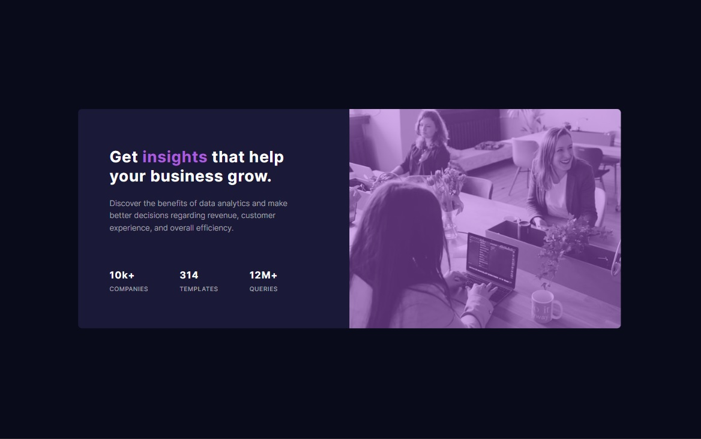
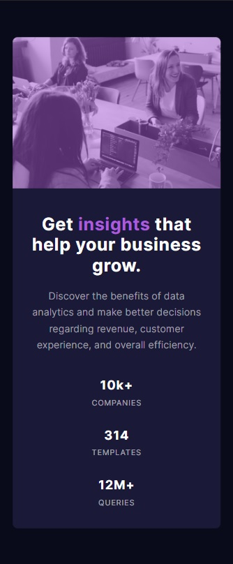

# Frontend Mentor - Stats preview card component solution

This is a solution to the [Stats preview card component challenge on Frontend Mentor](https://www.frontendmentor.io/challenges/stats-preview-card-component-8JqbgoU62). Frontend Mentor challenges help you improve your coding skills by building realistic projects.

## Table of contents

- [Overview](#overview)
  - [The challenge](#the-challenge)
  - [Screenshot](#screenshot)
  - [Links](#links)
- [My process](#my-process)
  - [Built with](#built-with)
  - [What I learned](#what-i-learned)
  - [Continued development](#continued-development)
  - [Useful resources](#useful-resources)
- [Author](#author)
- [Acknowledgments](#acknowledgments)

**Note: Delete this note and update the table of contents based on what sections you keep.**

## Overview

### The challenge

Users should be able to:

- View the optimal layout depending on their device's screen size

### Screenshot

### Links

[Solution URL](https://your-solution-url.com)
[Live site URL](https://zp021-stats-preview-card-component.netlify.app/)

## My process

### Built with

- Semantic HTML5 markup
- CSS custom properties
- Flexbox
- CSS Grid
- Mobile-first workflow

**Note: These are just examples. Delete this note and replace the list above with your own choices**

### What I learned

This is my fifth challenge and I can definitely say I feel more comfortable when approaching each design and how I would attempt to match the them as close as possible.

### Continued development

I still feel like I need to improve this further, so I'll go back and make little adjustments. Also i feel like i need to work on making my code cleaner, and choose the best options for each design.

## Author

- Frontend Mentor - [@zp021](https://www.frontendmentor.io/profile/zp021)
- GitHub - [@zp021](https://github.com/zp021)
